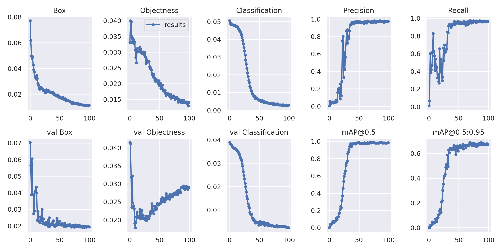
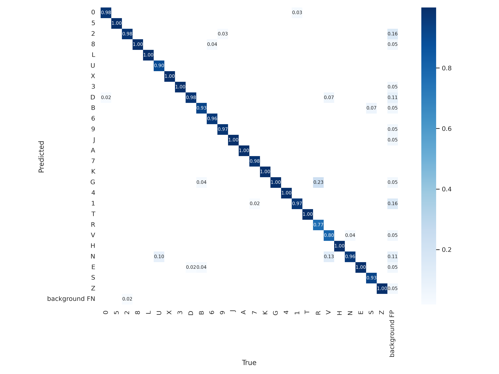
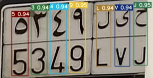
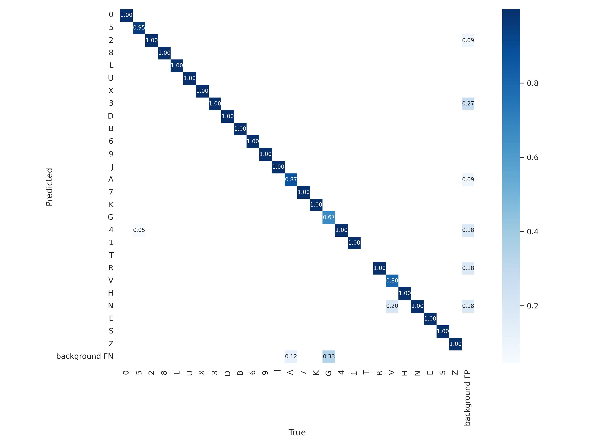

# Детектор символов на номерных знаках

Проект включает в себя анализ, внедрение аугментации, обучение модели и инференс в задаче распознавания символов на номерных знаках.

## Описание проекта

Цель данного проекта - разработать качественный детектор символов, способный обнаруживать и распознавать символы на номерных знаках с высокой точностью. 
Проект включает в себя следующие шаги:

1. **Анализ датасета**: Было произведено очищение, изучение и выявление дисбаланса классов в данных. 
Также была попытка упрощения задачи при помощи создания границ рамок, которые бы содержали вместо двух символов один. Результат эксперимента в experiment.ipynb.

2. **Аугментация данных**: Была использована для устранения дисбаланса классов и увеличения разнообразия данных была использована аугментация.

3. **Обучение модели**: Была использована YOLOv7 для обучения модели на имеющихся данных.

4. **Инференс**: Модель может быть использована для распознавания символов на номерных знаках в реальном времени.

## Требования

Часть работы была проделана локально, для обучения модели был использован Google Colab.
Перед тем как начать использовать проект, убедитесь, что у вас установлены следующие требования:

- Python 3.7
-  Зависимости из requirements.txt

## Использование
Для повторения эксперимента требуется последовательный запуск jupyter ноутбуков: 
- EDA.ipynb содержит основную часть анализа, а также создание аугментации данных и нового csv файла с новой разметкой. 
- prepare_data_for_yolo.ipynb преобразует данные полученные из EDA.ipynb в формат yolo и создает необходимые файлы для дальнейшей работы
- train_and_inference_yolov7.ipynb обучение и инференс сети. 
Запускался в Google Colab и использовал данные из Google Drive, инструкция по запуску имеется внутри ноутбука

## Результаты
[Веса обученной модели](https://drive.google.com/file/d/108uE9SrGDuKTN-T7XSseElxMAErSztxR/view?usp=sharing)

yolov7 показала следующие результаты:

График обучения
 

Матрица ошибок
 

Пример работы сети на тестовой выборке 

Полноценный результат работы сети на тестовой выборке показан в train_and_inference_yolov7.ipynb

Матрица ошибок на тестовой выборке
 

## Перспективы
В данной работе не были опробованы все виды моделей из 7-го семейства yolo и другие крупные архитектуры, из-за ограничений графических мощностей в Google Colab и недостатком их на своем устройстве.

В продолжении этой работы можно произвести сравнение с такими сетями как:
CRNN (Convolutional Recurrent Neural Network), Tesseract и EAST (Efficient and Accurate Scene Text Detector)

